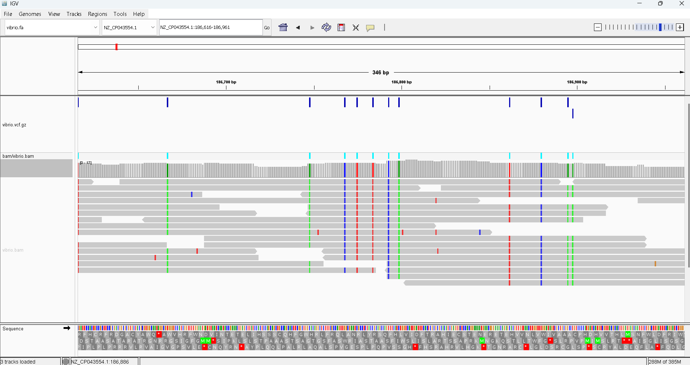
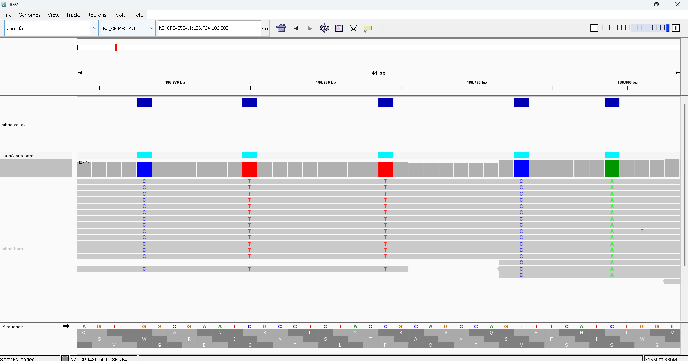

## Week 10: Generate a variant call file

The reference genome is a Vibrio cholerae whole genome sequence with Accession ID: GCF_008369605.1. The SRR is a Vibrio cholerae with SRR ID: SRR31137229. 

### Instructions:
Make sure you are in the bioinfo environment
```
conda activate bioinfo
```

Targets:
- usage - Show the targets
- refs  - Download the reference genome
- fastq - Download reads from SRA
- index - Index the reference genome
- align - Align the reads and convert to BAM
- stats - Generate alignment statistics
- vcf   - Call variants
- all   - Run entire pipeline
- clean - Remove all files

To run a target
```
make [target]
```

To run entire pipeline
```
make all
```

Please clean files at the end of the run
```
make clean
```

Open IGV, then load the refs/vibrio.fa genome to IGV.

Drag and drop vcf/vibrio.vcf.gz to IGV to see variant calls.

We should be able to see something like this


Zooming in, we get

