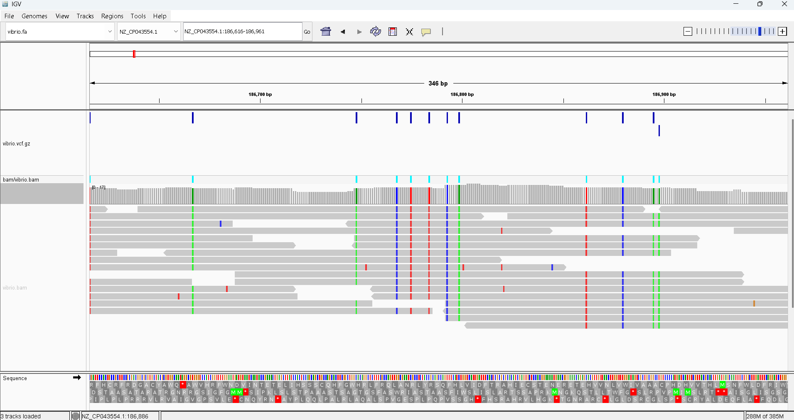
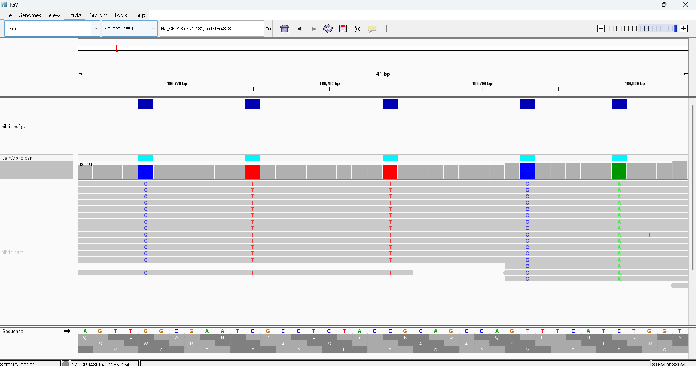
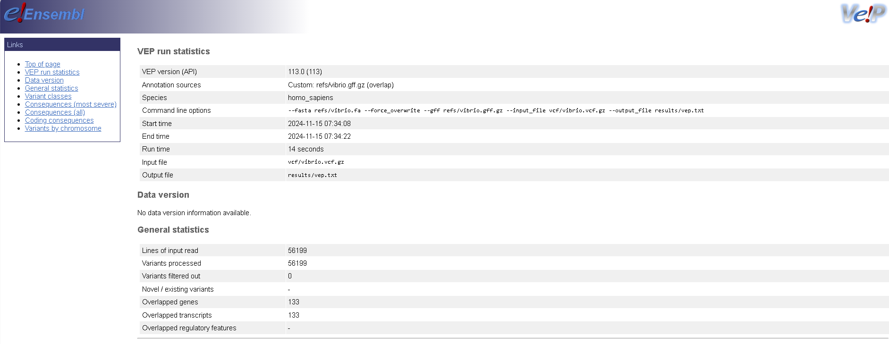

## Week 11: Establish the effects of variants

The reference genome is a Vibrio cholerae whole genome sequence with Accession ID: GCF_008369605.1. The SRR is a Vibrio cholerae with SRR ID: SRR31137229. 

### Instructions:
Make sure you install VEP in your system, following [Biostars Handbook](https://www.biostarhandbook.com/appbio/methods/vep/#how-to-install-vep-on-your-system) instructions:
```
# Create a new conda environment for VEP
micromamba create -y -n vep perl perl-dbi perl-lwp-simple perl-dbd-mysql perl-bio-db-hts

# Activate the environment
micromamba activate vep

# Make a directory for sources
mkdir -p ~/src

# Change to the source directory
cd ~/src

# Clone the VEP repository
git clone https://github.com/Ensembl/ensembl-vep

# Change to the VEP directory
cd ensembl-vep

# Install the VEP package
perl INSTALL.pl --NO_HTSLIB --NO_TEST

# Verify the installation
./vep --help
```

Also install other dependencies.
```
micromamba install make
micromamba install -c conda-forge ncbi-datasets-cli
micromamba install bwa
micromamba install bioconda::samtools
micromamba install bioconda::bcftools
```

Targets:
- usage - Show the targets
- refs  - Download the reference genome
- fastq - Download reads from SRA
- index - Index the reference genome
- align - Align the reads and convert to BAM
- stats - Generate alignment statistics
- vcf   - Call variants
- vep	- Annotate variant effect
- all   - Run entire pipeline
- clean - Remove all files

To run a target
```
make [target]
```

To run entire pipeline
```
make all
```

Please clean files at the end of the run
```
make clean
```

Open IGV, then load the refs/vibrio.fa genome to IGV.

Drag and drop vcf/vibrio.vcf.gz to IGV to see variant calls.

We should be able to see something like this


Zooming in, we get


In results directory, open vep.txt_summary.html to see VEP output. We should see a report similar to below:

