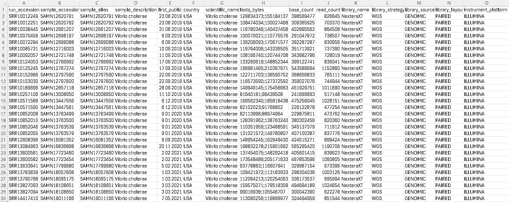

## Week 12: Automate a VCF calling pipeline

The reference genome is a Vibrio cholerae whole genome sequence with Accession ID: GCF_008369605.1. The SRR's can be downloaded from HCBI SRA from BioProject PRJNA266293.

### Instructions:

Construct the design.csv file as shown below. The SRR's listed are under BioProject PRJNA266293. I filtered to only get Vibrio cholerae.
```
bio search PRJNA266293 -H --csv > design.csv
```



Targets:
- usage - Show the targets
- refs  - Download the reference genome
- index - Index the reference genome
- fastq - Download reads from SRA
- align - Align the reads and convert to BAM
- stats - Generate alignment statistics
- vcf   - Call variants
- all   - Run entire pipeline
- clean - Remove all files

To run a target
```
make [target]
```

To do a dry run of the automated process
```
cat design.csv | head -50 | \
    parallel --dry-run --lb -j 4 --colsep , --header : \
    make all SRR={run_accession}
```

### Step 1. First, make sure to download and index reference genome
```
make refs index
```

### Step 2. To run entire pipeline
```
cat design.csv | head -50 | \
    parallel --verbose --lb -j 4 --colsep , --header : \
    make all SRR={run_accession}
```

### Step 3. After completing the pipeline, merge and index VCF files into one file
```
# Merge VCF files
bcftools merge -0 vcf/*.vcf.gz -Oz > merged.vcf.gz

# Index the merged VCF file
bcftools index merged.vcf.gz
```

Open IGV, then load the refs/vibrio.fa genome to IGV.

Drag and drop merged.vcf.gz to IGV to see the merged variant calls. We should see something like shown below:


Here we see several variant calls among SRR's of Vibrio cholerae against the RefSeq reference of the same species. Perhaps, we need to filter out variant calls with low quality score or depth, to capture more significant variants and remove noise.

Please clean files at the end of the run
```
make clean
```
