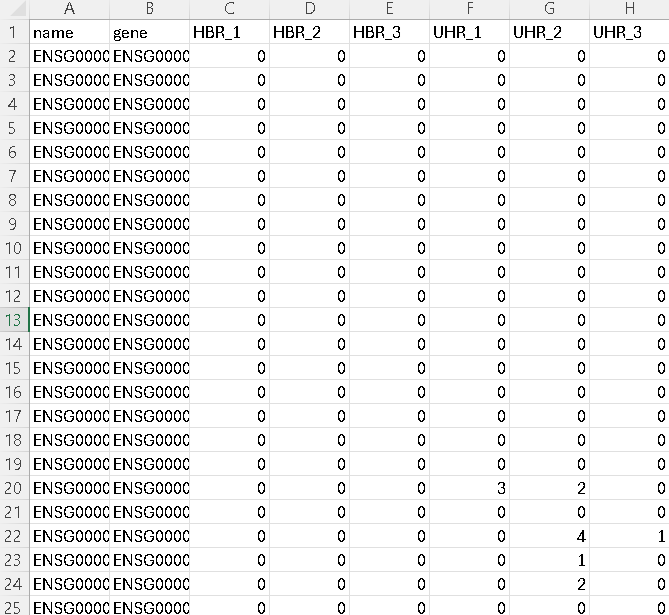

## Week 13: Generate an RNA-Seq count matrix

We will be using the dataset from the Biostar Workflows: [RNA-Seq with Hisat2 tutorial](https://www.biostarhandbook.com/books/workflows/rnaseq/rnaseq-using-hisat/).

### Instructions:

Make sure to have the Biostar Toolbox in the same directory
```
# Get the toolbox code
bio code
```

Step 1. Create a design.csv file that contains the following:
```
sample,group
HBR_1,HBR
HBR_2,HBR
HBR_3,HBR
UHR_1,UHR
UHR_2,UHR
UHR_3,UHR
```

Step 2. Create count.txt
Activate bioinfo environment
```
conda activate bioinfo
```

Run the count pipeline
```
make count
```

Step 3. Do post-count process
Activate stats environment
```
conda activate stats
```

Run the post-count pipeline
```
make post
```

We should get a counts.csv file as shown below:


