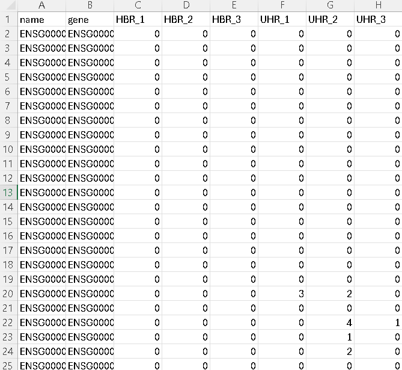
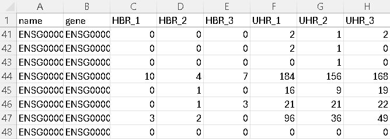
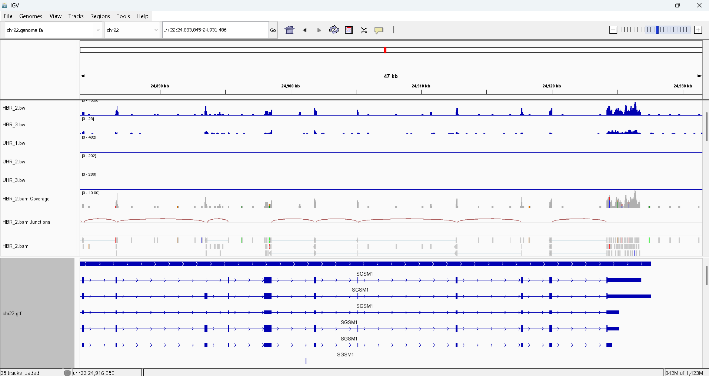
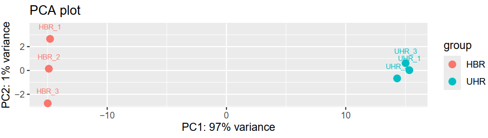
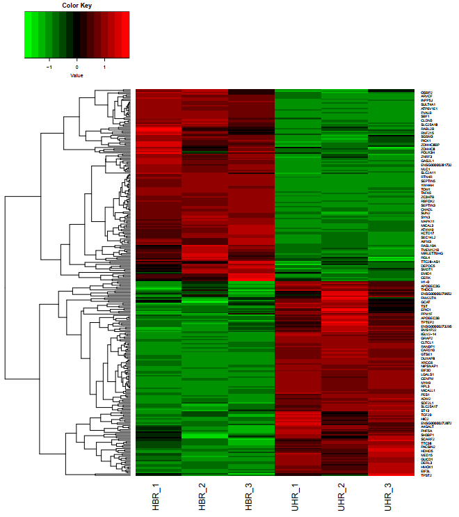
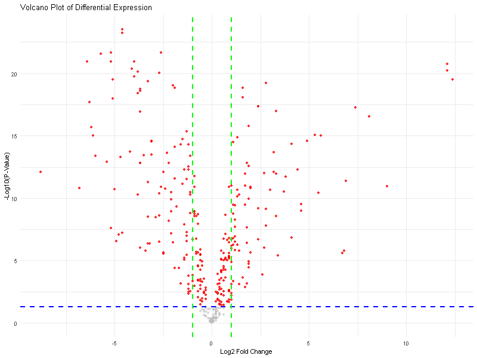

## Week 14: Perform a differential expression analysis

We will be using the dataset from the Biostar Workflows: [RNA-Seq with Hisat2 tutorial](https://www.biostarhandbook.com/books/workflows/rnaseq/rnaseq-using-hisat/).

### Instructions:

Make sure to have the Biostar Toolbox in the same directory
```
# Get the toolbox code
bio code
```

Step 1. Create a design.csv file that contains the following:
```
sample,group
HBR_1,HBR
HBR_2,HBR
HBR_3,HBR
UHR_1,UHR
UHR_2,UHR
UHR_3,UHR
```

Step 2. Create count.txt

Activate bioinfo environment
```
conda activate bioinfo
```

Run the count pipeline
```
make count
```

Step 3. Do post-count process

Activate stats environment
```
conda activate stats
```

Run the post-count pipeline
```
make post
```

We should get a counts.csv file as shown below:



First we see that the data is sparse (a lot of zeros). We check some gene entries that can give us insight.



Here, we can see by eye-balling that the counts of HBR's and UHR's are clearly delineated.

Next, we verify in IGV that indeed what we have are RNA's



Looking at the red arches, indicating that the splice-aware alignment by Hisat2 is working and at the bottom clearly showing exons. These are indeed RNA's.

Step 4. Execute differential expression analysis
```
make diffexpr
```

We should be able to see an `edger.csv` file.

Step 5. Do post-differential expression analysis process
```
make post-diffexpr
```

We performed Pricipal Component Analysis (PCA). Here, we see a clear separation between the `HBR` and `UHR` samples.



Next, we also created a heatmap based on the gene expressions of said samples. This validates the clustering between the `HBR` and `UHR` samples.



I added an R script to create a volcano plot. This is included in the `post` target. The volcano plot is as shown below:



Finally, we can check the differentially expressed genes from the `edger.csv`. Here are the results summary:

**Number of Significant Genes:**

288 genes were identified as significant (FDR < 0.05), representing ~80% of the total genes analyzed.

**Expression Levels:**

Log2 fold changes for significant genes range from -8.8 (downregulated) to 12.4 (upregulated).

Median log2 fold change: 0.2, indicating a slight bias toward upregulation.

**Distribution:**

25th percentile: -1.525 (downregulated genes with moderate change).

75th percentile: 1.1 (upregulated genes with moderate change).

**Reliability of Data:**

The large number of significant genes and extreme fold changes suggest robust detection of differentially expressed genes.
