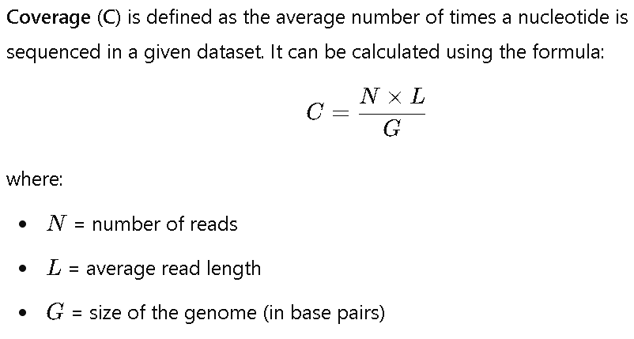

## Week 5: Simulating FASTQ files

### Instructions:
Make sure you are in the bioinfo environment
```
conda activate bioinfo
```

Run hw5.sh
```
bash hw5.sh
```

### 1. Select a genome, then download the corresponding FASTA file.
The size of the file
```
4190374
```

The total size of the genome
```
4190143
```

The number of chromosomes (including plasmid) in the genome
```
3
```

The name (id) and length of each chromosome or plasmid in the genome
```
NZ_CP043554.1 2948589
NZ_CP043556.1 1140710
NZ_CP043555.1 49113
```

### 2. Generate a simulated FASTQ output for a sequencing instrument of your choice. Set the parameters so that your target coverage is 10x.
How many reads have you generated? (defined)
```
2
```

What is the average read length? (defined)
```
150
```

How big are the FASTQ files?
Read 1:
```
98705972
```
Read 2:
```
98705972
```

Compress the files and report how much space that saves.
Saved this much space for read 1: (values may vary)
```
80297486
```
Saved this much space for read 2: (values may vary)
```
80297852
```

Discuss whether you could get the same coverage with different parameter settings (read length vs. read number).

It is possible to achieve the same coverage using different parameter settings of read length and number of reads. As long as the coverage (C) remains fixed (e.g. value of 10 for 10x coverage) as shown below:



However, the choice between longer reads and more reads depends on the specific goals of the sequencing project, including the need for accuracy, resolution, computational efficiency, and cost. Each combination may come with trade-offs that could affect the overall quality of the sequencing results.

### 3. How much data would be generated when covering the Yeast, the Drosophila or the Human genome at 30x?
Using the figure above, we can play around with the values of each elements there. 

### Yeast:
For the case of yeast, the genome size (G) is about 12,000,000 bp or 12 Mbp. Calculating from Question 1 (1.00005x ratio), the **size of the fasta file is 12,000,600 Bytes**. 

We fix the coverage (C) to 30 and read length (L) to 150 bp. We get **number of reads (N) of 2,400,000 reads**.

For a 30x coverage, the **fastq file** is more or less 12,000,000 x 30 = 360,000,000 or **360 MB**. 

Calculating the compression rate from Question 2, we get a compression rate of 80%. Thus, we get a **compressed fastq size** of 72,000,000 or **72 MB**.

### Drosophila:
For the case of Drosophila, the genome size (G) is about 140,000,000 bp or 140 Mbp. Calculating from Question 1 (1.00005x ratio), the **size of the fasta file is 140,007,000 Bytes**. 

We fix the coverage (C) to 30 and read length (L) to 150 bp. We get **number of reads (N) of 28,000,000 reads**.

For a 30x coverage, the **fastq file** is more or less 140,000,000 x 30 = 4,200,000,000 or **4.2 GB**. 

Calculating the compression rate from Question 2, we get a compression rate of 80%. Thus, we get a **compressed fastq size** of 840,000,000 or **840 MB**.

### Human:
For the case of human, the genome size (G) is about 3,200,000,000 bp or 3.2 Gbp. Calculating from Question 1 (1.00005x ratio), the **size of the fasta file is 3,200,160,000 Bytes**. 

We fix the coverage (C) to 30 and read length (L) to 150 bp, We get **number of reads (N) of 640,000,000 reads**.

For a 30x coverage, the **fastq file** is more or less 3,200,000,000 x 30 = 96,000,000,000 or **96 GB**. 

Calculating the compression rate from Question 2, we get a compression rate of 80%. Thus, we get a **compressed fastq size** of 19,200,000,000 or **19.2 GB**.
