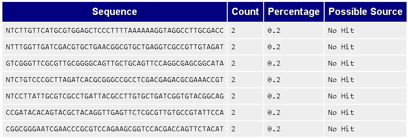

## Week 6: FASTQ Quality Control

### Instructions:
Make sure you are in the bioinfo environment
```
conda activate bioinfo
```

Locate the hw6.sh file and run it
```
bash hw6.sh
```

### Evaluation of the read quality:

**Per base sequence quality:**


We see that the reads in first three positions fall below a Phred score of 30 (corresponds to 99.9% accuracy [link](https://hbctraining.github.io/Training-modules/planning_successful_rnaseq/lessons/QC_raw_data.html)). In particular, the read in position 1 has a poor quality Phred score of 2, positions 2 and 3 dip to Phred score of 27. The rest of the positions are above the Phred score of 30.

**Per tile sequence quality**


We see here that all positions are colored in blue, which represents good quality.

**Per sequence quality scores**


We see here a good quality graph where most reads have an average Phred score of 37, which is well above our cutoff Phred score of 30.

**Per base sequence content**


We see here a poor quality graph. Most glaring are the reads in the first nine positions. However, the succeeding positinos also denote poor quality. Ideally, we want to see two horizontal lines with A and T overlapping, and C and G overlapping. Since these are conjugate base pairs, we expect them to overlap perfectly.

**Per sequence GC content**


We see a poor quality graph here. Ideally, the actual GC distribution should overlap with the theoretical GC distribution.

**Per base N content**


We see a poor quality read at position 1, with over 50% of the reads denoted with 'N'. This indicates that the sequencer is unable to identify the correct base with adequate certainty.

**Sequence Length Distribution**


We see a good quality sequence length distribution, with all reads having 100 base pairs in length.

**Sequence Duplication Levels**


We see a good quality graph for sequence duplication, with almost no duplications identified.

**Overrepresented sequences**



We see here seven sequences with count of 2. It was flagged as warning by fastqc but it is not definite that these represent poor quality sequences.

**Adapter Content**


We see here a good quality graph showing a flat line at zero for all read positions. This indicates that they did not detect any adapter sequence artifacts.

