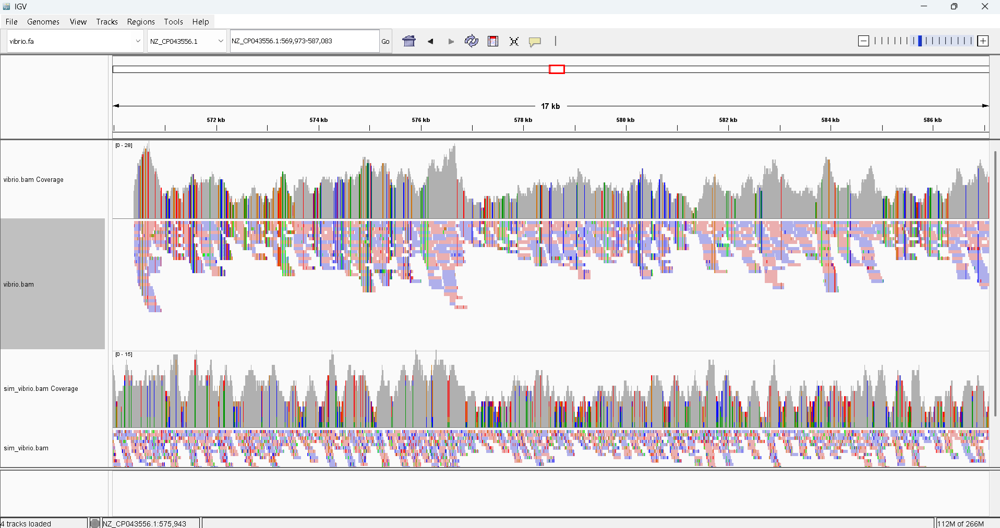

## Week 8: Generate a BAM alignment file

The reference genome is a Vibrio cholerae whole genome sequence with Accession ID: GCF_008369605.1. The SRR is a Vibrio cholerae with SRR ID: SRR31137229. 

### Instructions:
Make sure you are in the bioinfo environment
```
conda activate bioinfo
```

Targets:
- usage - Show the targets
- refs  - Download the reference genome
- simulate - Simulate reads
- fastq - Download reads from SRA
- index - Index the reference genome
- align - Align the reads and convert to BAM
- stats - Generate alignment statistics
- all   - Run entire pipeline
- clean - Remove all files

To run a target
```
make [target]
```

To run entire pipeline
```
make all
```

Please clean files at the end of the run
```
make clean
```

### Output:

Open IGV, load the vibrio.fa reference genome located in the refs directory, then load the two bam files (vibrio.bam and sim_vibrio.bam) located in the bam directory. The output should look like:

